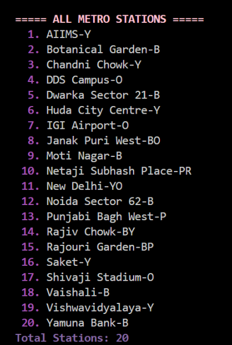
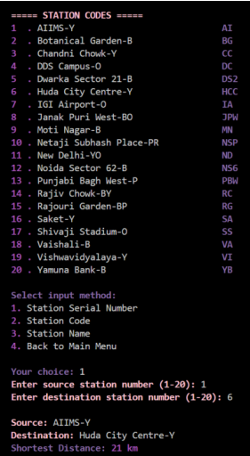
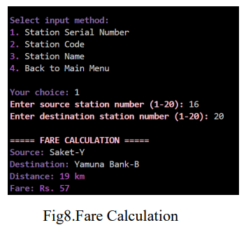
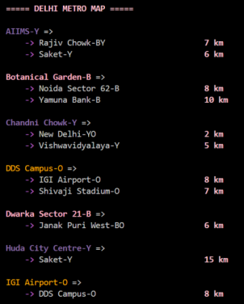

#  Smart Metro Navigator

##  Overview

**Smart Metro Navigator** is a Data Structures-based application that helps users find the **shortest path between metro stations** efficiently.

It uses **Dijkstra’s Algorithm** to compute optimal routes based on distance and time, providing users with accurate navigation and fare estimation.

This project demonstrates strong understanding of **graph data structures, algorithms, and real-world problem solving**.

---

##  Key Features

###  Metro Graph Representation

* Stations represented as nodes
* Connections represented as edges
* Efficient graph implementation using maps

###  Shortest Path (Distance)

* Calculates minimum distance route
* Displays full path with interchanges

###  Shortest Path (Time)

* Computes fastest route
* Optimized for travel time

###  Fare Calculation

* Calculates fare based on distance
* Displays total cost

###  User Authentication

* Login system for users
* Secure access flow

###  Feedback System

* Users can submit feedback
* Improves system usability

---

## 🛠️ Tech Stack

* **Language:** C++
* **Concepts:**

  * Graph Data Structure
  * Dijkstra’s Algorithm
  * Priority Queue
  * Maps / Unordered Maps

---

##  How to Run

### Compile

```bash
g++ main.cpp -o metro
```

### Run

```bash
./metro
```

---

##  Output Screenshots

###  Metro Stations & Map



---

###  Route Details



---

###  Shortest Path (Distance)

.png)

---

###  Shortest Path (Time)

.png)

---

###  Fare Calculation



---

###  Metro Route Output



---

##  Real-World Use Cases

* Helps users navigate metro systems efficiently
* Finds optimal routes quickly
* Useful for transport system simulations
* Demonstrates real-world graph applications

---

##  Future Enhancements

* GUI-based interface
* Real-time metro data integration
* Mobile application version
* Multi-city support

---

##  What Makes This Project Stand Out

* Real-world application of **Dijkstra’s Algorithm**
* Strong use of **graph data structures**
* Multiple features beyond basic pathfinding
* Clean modular design

---

##  Note

This project was developed as part of a Data Structures project.
I contributed to the implementation of graph logic and shortest path algorithm.

---

##  Author

**Anwesha Sharma**
